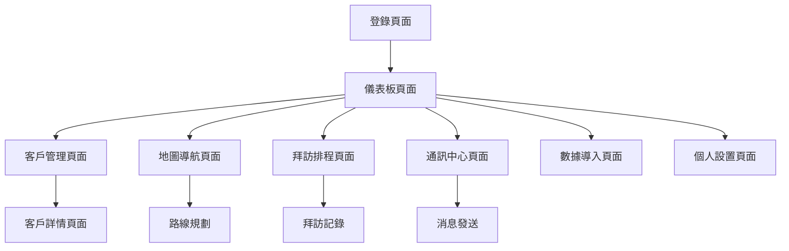

# Casmara CRM 超級業務員 - 產品需求文檔

## 1. 產品概述

Casmara CRM 超級業務員是一款專為美容產品業務員設計的客戶關係管理系統，主要服務於西班牙Cádiz省和Huelva省的美容產品銷售業務。
- 解決業務員客戶管理分散、拜訪路線規劃困難、客戶聯繫效率低下等問題，提升銷售團隊的工作效率和客戶服務質量。
- 目標是成為西班牙南部地區領先的美容產品CRM解決方案，幫助業務團隊實現數字化轉型。

## 2. 核心功能

### 2.1 用戶角色

| 角色 | 註冊方式 | 核心權限 |
|------|----------|----------|
| 業務員 | 管理員邀請註冊 | 客戶管理、拜訪排程、地圖導航、通訊功能 |
| 業務主管 | 系統管理員創建 | 所有業務員功能 + 團隊數據查看、報表分析 |
| 系統管理員 | 超級管理員權限 | 全系統管理、用戶管理、數據導入導出 |

### 2.2 功能模塊

我們的CRM系統包含以下主要頁面：
1. **儀表板頁面**：數據概覽、今日任務、快速操作入口
2. **客戶管理頁面**：客戶列表、客戶詳情、新增編輯客戶
3. **地圖導航頁面**：客戶位置展示、路線規劃、實時定位
4. **拜訪排程頁面**：日程管理、拜訪記錄、任務提醒
5. **通訊中心頁面**：短信發送、郵件管理、通訊記錄
6. **數據導入頁面**：Excel客戶名單導入、數據驗證
7. **個人設置頁面**：用戶資料、偏好設置、密碼修改

### 2.3 頁面詳情

| 頁面名稱 | 模塊名稱 | 功能描述 |
|----------|----------|----------|
| 儀表板頁面 | 數據概覽 | 顯示客戶總數、本月拜訪次數、銷售業績等關鍵指標 |
| 儀表板頁面 | 今日任務 | 展示當日拜訪計劃、待辦事項、緊急提醒 |
| 儀表板頁面 | 快速操作 | 提供新增客戶、安排拜訪、發送消息等快捷入口 |
| 客戶管理頁面 | 客戶列表 | 分頁顯示客戶信息、搜索過濾、批量操作 |
| 客戶管理頁面 | 客戶詳情 | 查看完整客戶資料、拜訪歷史、購買記錄 |
| 客戶管理頁面 | 客戶編輯 | 新增、修改、刪除客戶信息，包含城市選擇（Cádiz省、Huelva省） |
| 地圖導航頁面 | 客戶地圖 | 在地圖上標記客戶位置，顯示名稱、地址、電話 |
| 地圖導航頁面 | 路線規劃 | 計算最優拜訪路線，提供導航功能 |
| 地圖導航頁面 | 實時定位 | 顯示業務員當前位置，計算與客戶的距離 |
| 拜訪排程頁面 | 日程管理 | 日曆視圖管理拜訪安排，支持拖拽調整 |
| 拜訪排程頁面 | 拜訪記錄 | 記錄拜訪結果、客戶反饋、後續跟進計劃 |
| 拜訪排程頁面 | 任務提醒 | 自動提醒拜訪時間、發送通知到手機或郵箱 |
| 通訊中心頁面 | 短信發送 | 向客戶發送促銷信息、拜訪確認等短信 |
| 通訊中心頁面 | 郵件管理 | 發送郵件、管理郵件模板、查看發送記錄 |
| 通訊中心頁面 | 通訊記錄 | 記錄所有與客戶的通訊歷史 |
| 數據導入頁面 | Excel導入 | 批量導入客戶數據，支持數據驗證和錯誤提示 |
| 數據導入頁面 | 數據映射 | 將Excel欄位映射到系統字段，處理數據格式 |
| 個人設置頁面 | 用戶資料 | 修改個人信息、聯繫方式、頭像上傳 |
| 個人設置頁面 | 系統偏好 | 設置語言、時區、通知偏好等 |

## 3. 核心流程

**業務員日常工作流程：**
用戶登錄系統後進入儀表板查看今日任務 → 在客戶管理頁面查找或新增客戶 → 使用地圖功能規劃拜訪路線 → 在拜訪排程頁面安排具體時間 → 通過通訊中心發送拜訪確認消息 → 實地拜訪時使用地圖導航 → 拜訪後記錄結果和後續計劃。

**管理員數據管理流程：**
管理員登錄後台 → 在數據導入頁面上傳Excel客戶名單 → 系統驗證數據格式並提示錯誤 → 確認導入後客戶數據自動分配給相應業務員 → 在用戶管理中為新業務員創建賬號並分配權限。

## 4. 用戶界面設計

### 4.1 設計風格

- **主色調**：深藍色 (#1E3A8A) 作為主色，淺藍色 (#3B82F6) 作為輔助色，體現專業可靠
- **按鈕風格**：圓角矩形按鈕，具有微妙陰影效果，懸停時有顏色變化
- **字體**：中文使用思源黑體，英文使用 Inter，主要字號 14px-16px
- **佈局風格**：卡片式設計，左側導航欄，頂部工具欄，內容區域採用網格佈局
- **圖標風格**：使用 Heroicons 圖標庫，線性風格，保持一致性

### 4.2 頁面設計概覽

| 頁面名稱 | 模塊名稱 | UI元素 |
|----------|----------|--------|
| 儀表板頁面 | 數據概覽 | 統計卡片使用白色背景，藍色邊框，大號數字顯示，配色 #F8FAFC 背景 |
| 儀表板頁面 | 今日任務 | 任務列表採用時間軸設計，未完成任務橙色標記 (#F59E0B) |
| 客戶管理頁面 | 客戶列表 | 表格設計，斑馬紋背景，搜索框置頂，操作按鈕右對齊 |
| 客戶管理頁面 | 客戶詳情 | 左右分欄佈局，左側基本信息，右側拜訪歷史，使用標籤頁切換 |
| 地圖導航頁面 | 客戶地圖 | 全屏地圖，左側客戶列表面板可收縮，客戶標記使用自定義圖標 |
| 地圖導航頁面 | 路線規劃 | 底部工具欄，包含起點終點選擇，路線優化按鈕使用綠色 (#10B981) |
| 拜訪排程頁面 | 日程管理 | 月曆視圖，事件卡片使用不同顏色區分類型，支持拖拽操作 |
| 通訊中心頁面 | 短信發送 | 聊天界面風格，消息氣泡設計，發送按鈕藍色圓形 |

### 4.3 響應式設計

系統採用移動優先的響應式設計，支持桌面端、平板和手機端訪問。在移動端優化觸控操作，地圖功能支持手勢縮放，表格在小屏幕上自動轉為卡片佈局。