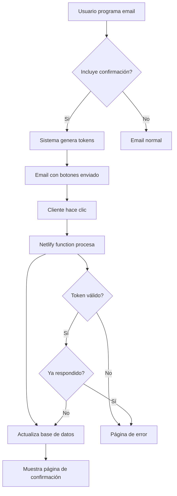

# Sistema de Confirmación de Citas Interactivas

## Descripción General

El sistema permite enviar emails con botones interactivos para que los clientes puedan confirmar citas o solicitar reprogramaciones directamente desde el email, sin necesidad de responder manualmente.

## Características Principales

### ✅ **Botones Interactivos**
- **Confirmar Cita**: Cliente confirma la cita programada
- **📅 Reprogramar**: Cliente solicita reprogramar la cita

### 🔒 **Seguridad**
- Tokens únicos e irrepetibles para cada enlace
- Protección contra uso múltiple del mismo token
- Seguimiento de IP y user agent del cliente

### 📊 **Seguimiento**
- Base de datos completa de respuestas de clientes
- Timestamps de cuando respondieron
- Estado de cada respuesta (pendiente/respondida)

## Cómo Usar

### 1. Programar Mensaje con Confirmación

1. Ve a **Communications** → **Programar Mensaje**
2. Selecciona **Email** como tipo de mensaje
3. Completa los campos normalmente:
   - Selecciona clientes
   - Escribe asunto y mensaje
   - Programa fecha/hora
4. **✅ Marca la casilla "📅 Incluir botones de confirmación de cita"**
5. Guarda el mensaje

### 2. Contenido Automático Añadido

Cuando activas la confirmación, se añade automáticamente:

```html
┌─────────────────────────────────────┐
│        Pendiente de Confirmación    │
│                                     │
│  ✅ Confirmar Cita  📅 Reprogramar  │
│                                     │
│ Haga clic en uno de los botones...  │
└─────────────────────────────────────┘

┌─────────────────────────────────────┐
│      ¿Necesita contactar con Charo? │
│                                     │
│ Si tiene alguna pregunta o necesita │
│ hacer algún cambio, no dude en     │
│ contactar directamente con Charo... │
│                                     │
│ 📞 +34 646 11 67 04                │
│ ✉️ rosariog.almenglo@gmail.com      │
│ 💬 WhatsApp Charo                   │
│                                     │
│ © 2025 Casmara. Todos los derechos │
│ reservados.                         │
└─────────────────────────────────────┘
```

### 3. Experiencia del Cliente

1. **Cliente recibe el email** con los botones
2. **Cliente hace clic** en "Confirmar Cita" o "Reprogramar"
3. **Sistema registra la respuesta** automáticamente
4. **Cliente ve página de confirmación** con información de contacto de Charo

## Páginas de Respuesta

### ✅ Confirmación Exitosa
- Mensaje de cita confirmada
- Recordatorio de que recibirá notificación antes de la fecha
- Información de contacto de Charo

### 📅 Solicitud de Reprogramación
- Confirmación de que se recibió la solicitud
- Información de que Charo se pondrá en contacto pronto
- Datos de contacto completos

### ❌ Error (Token Inválido/Usado)
- Mensaje de error claro
- Información de contacto para asistencia

## Configuración Técnica

### Variables de Entorno Requeridas

```bash
# Supabase (ya configuradas)
VITE_SUPABASE_URL=
SUPABASE_SERVICE_ROLE_KEY=

# Gmail API (ya configuradas)
GMAIL_CLIENT_ID=
GMAIL_CLIENT_SECRET=
GMAIL_REFRESH_TOKEN=
GMAIL_FROM_EMAIL=

# Netlify Deploy URL (automática)
URL=https://carmara-crm.netlify.app
```

### Base de Datos

La tabla `appointment_responses` se crea automáticamente con la migración:

```sql
-- Campos principales
id, message_id, customer_id, response_token
response_type ('confirm' | 'reschedule')
responded_at, customer_ip, customer_user_agent
created_at, updated_at

-- Relaciones
customers (nombre, email, empresa)
scheduled_messages (mensaje original)
```

## Flujo Técnico



## Testing y Verificación

### 1. Envío de Email de Prueba
```bash
# Desde Communications
1. Crea mensaje de prueba
2. Selecciona tu propio email como cliente
3. Activa confirmación de cita
4. Envía inmediatamente
```

### 2. Verificar Enlaces
```bash
# URLs generadas automáticamente:
https://carmara-crm.netlify.app/.netlify/functions/appointment-response?token=XXXXX
```

### 3. Comprobar Base de Datos
```sql
-- Ver respuestas registradas
SELECT * FROM appointment_responses 
JOIN customers ON appointment_responses.customer_id = customers.id
ORDER BY created_at DESC;
```

## Solución de Problemas

### Email no llega
1. ✅ Verificar variables Gmail API en Netlify
2. ✅ Comprobar que el email del cliente es válido
3. ✅ Revisar logs de Netlify Functions

### Botones no funcionan
1. ✅ Verificar URL base en variable `URL` de Netlify
2. ✅ Comprobar que la función `appointment-response` está desplegada
3. ✅ Revisar logs de la función para errores

### Respuestas no se registran
1. ✅ Verificar migración de base de datos aplicada
2. ✅ Comprobar permisos RLS en Supabase
3. ✅ Revisar tokens generados correctamente

## Próximos Pasos

### Mejoras Sugeridas
- [ ] Panel de administración para ver respuestas
- [ ] Notificaciones push cuando cliente responde
- [ ] Recordatorios automáticos de citas confirmadas
- [ ] Integración con calendario
- [ ] Analytics de tasas de confirmación

### Personalización
- [ ] Plantillas de email personalizables
- [ ] Colores y estilos de botones configurables
- [ ] Mensajes de confirmación personalizados
- [ ] Múltiples idiomas

## Soporte

Para cualquier problema con el sistema de confirmación de citas:

**Desarrollador**: Cascade AI  
**Documentación**: Este archivo  
**Repositorio**: artjetca/carmara-crm  
**Función**: `netlify/functions/appointment-response.js`
